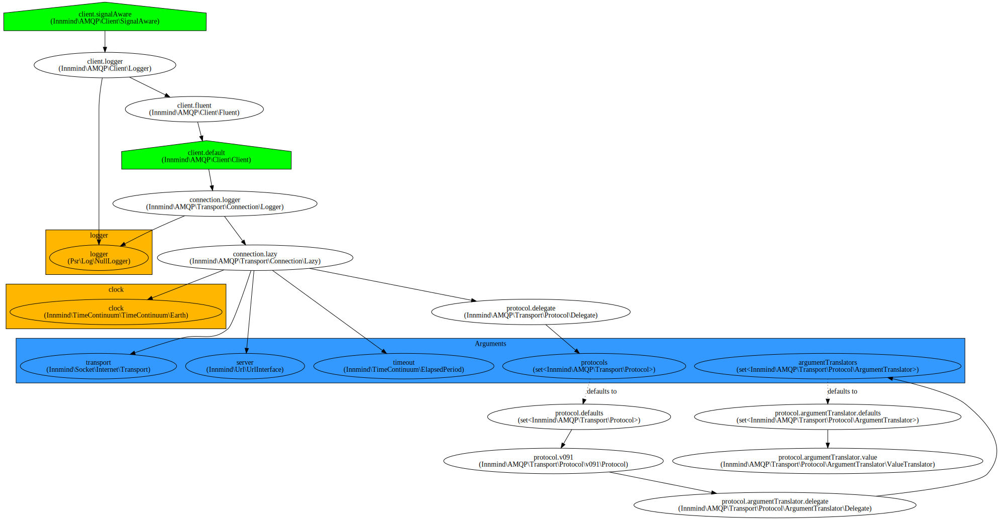

# Compose

| `master` | `develop` |
|----------|-----------|
| [](https://scrutinizer-ci.com/g/Innmind/Compose/?branch=master) | [](https://scrutinizer-ci.com/g/Innmind/Compose/?branch=develop) |
| [](https://scrutinizer-ci.com/g/Innmind/Compose/?branch=master) | [](https://scrutinizer-ci.com/g/Innmind/Compose/?branch=develop) |
| [](https://scrutinizer-ci.com/g/Innmind/Compose/build-status/master) | [](https://scrutinizer-ci.com/g/Innmind/Compose/build-status/develop) |

`Compose` is dependency injection container. It is born out of the recurring problem that many libraries need a complex initialisation of objects in order to work. The usual approach is to build a dedicated bundle when you use Symfony, or the equivalent for other frameworks, but this can lead with the bundle being out of sync with the library. It leads to extra work to apply the changes of the library back to the bundle. And this should be done for every framework you want to support, which can be tedious. All of this to provide an easy way for the end user of the library to use it.

The second reason that have motivated this library is the way all the existing (that I'm aware of) dependency injection containers use a _shared global state_, meaning the initialisation of all dependencies/libraries are in the same container. This means that if you're not careful you can easily end up coupling libraries by accessing objects from different libraries that should not be exposed. Since the containers doesn't explicitly say which services you can access, you can end up doint it without realising it. The end problem being that an update of the library can break your app because you rely on private stuff.

With all of this in mind, `Compose` has been built with these principles:

* consider the container as a function
* building an app should use composition

**Note**: `Compose` implements the [PSR-11](https://www.php-fig.org/psr/psr-11/) interface

## Installation

```sh
composer require innmind/compose
```

## Usage

The first part is defining the services. For the moment the only way is via a yaml file.

Example:

```yml
arguments:
    logger: Psr\Log\LoggerInterface
    http: Innmind\HttpTransport\Transport
    clock: Innmind\TimeContinuum\TimeContinuumInterface ?? $defaultClock

dependencies:
    amqp path/to/amqp/definition.yml:
        clock: $clock

expose:
    crawler: $crawler

services:
    crawler Innmind\Crawler\Crawler:
        - $http
        - $amqp.client
```

And then build the container:

```php
use Innmind\Compose\{
    ContainerBuilder\ContainerBuilder,
    Loader\Yaml
};
use Innmind\Url\Path;
use Innmind\Immutable\Map;

$build = new ContainerBuilder(new Yaml);

$psr11Container = $build(
    new Path('definition.yml'),
    (new Map('string', 'mixed'))
        ->put('logger', new \Psr\Log\NullLogger)
        ->put('http', new \Innmind\HttpTransport\GuzzleTransport)
);
```

This is a dummy exmaple to describe all the main parts of the container definition. The only 2 required keys here are `services` and `expose`.

The `services` key will contain all the definitions to build your objects. The definitions can be nested inside sub arrays, without depth limit, (like below) but the deepest array must nbe a service definition (otherwise the container will complain).

```yml
services:
    foo:
        bar:
            crawler Innmind\Crawler\Crawler: []
```

The `expose` key explicit the services you allow to expose to the outside world, with keys being the name you expose to the world and values being the references to the services definition described below it.

The `arguments` key is the implementation of the _function_ principle (described above). It explicit the arguments you need to provide when building the library. For each argument you need to tell the type you expect, you can use:

* anything that as a `is_{type}` function (ie: `int`, `float`, `string`, etc...)
* any class name
* `sequence`, shortcut for `Innmind\Immutable\Sequence`
* `map<K, V>`, it tells that you want an object implementing `Innmind\Immutable\MapInterface`, where `K` and `V` can be anything supported by this interface
* `set<T>`, it tells that you want an object implementing `Innmind\Immutable\SetInterface`, where `T` can be anything supported by this interface
* `stream<T>`, it tells that you want an object implementing `Innmind\Immutable\StreamInterface`, where `T` can be anything supported by this interface

**Note**: you can create your own types, see the [`Type`](src/Definition/Argument/Type.php) interface and [`Types`](src/Definition/Argument/Types.php) to be used in the [loader](src/Loader/Yaml.php).

For each type you can prefix it by `?` meaning it is optional. So if you do not provide it when building the container it will resolve to `null`. Or you can specify the argument to resolve to a default value then you can use the syntax `{type} ?? ${reference}`, where `reference` is the name of one of the services you've defined.

Finally, the `dependencies` key shouldn't be used when defining the container for a library, but only when defining your app. It should be used in case of an app as it is at this final level where you can have cross dependencies between the libraries you want to use. Each key/value pair defined under a dependency are the arguments provided to the sub container. The path provided for the dependency is relative to your definition path, check the [tests](tests/Loader/PathResolver/RelativeTest.php#L36) to have concrete examples. You can also use the syntax `@{vendor}/{package}/path/to/container.yml` that will resolve to the path to a composer package.

### Reference system

In order to reference a service or an argument you use the syntax `${service_or_argument_name}`, however not everything is accessible for everywhere. Allowed references:

* an argument default can only be a service you've defined, dependencies are not allowed
* a dependency parameter can be an argument, one of your services or an exposed service from another dependency
* a service argument can be a container argument, another service or a dependency service

### Services

#### Constructors

A service definition must always follow the pattern `{name} {constructor}` where the constructor part most of the time will be a class name, but your not limited to that. Here are all the constructor patterns:

* a class name, as just mentioned
* `{class}::{method}` describing a factory method
* `$factory->{method}` describing to call the method on the first argument declared that will be used as the factory object
* `map<K, V>` that will create an instance of `Innmind\Compose\Lazy\Map` with `K` and `V` types
* `set<T>` that will create an instance of `Innmind\Compose\Lazy\Set` with `T` type
* `stream<T>` that will create an instance of `Innmind\Compose\Lazy\Stream` with `T` type
* `merge` that will merge all arguments together, only works if arguments are instances of `Innmind\Immutable\MapInterface` or `Innmind\Immutable\SetInterface`

**Note**: `map`, `set` and `stream` are structures that lazy load the services (if coming from one of your definitions) injected into them, meaning those services will be instantiated only upon the first manipulation of the structure. This is done so you can easily build an event listener, command bus (or other) without injecting the full container in those services.

**Note**: you can create your own constructors, see the [`Constructor`](src/Definition/Service/Constructor.php) interface and [`Constructors`](src/Definition/Services/Constructors.php) to be used in the [loader](src/Loader/Yaml.php).

#### Arguments

Full list of argument patterns you can use:

* any primitive value
* `${reference}`, see the reference system above
* `...${reference}`, this will load the reference and unwind it. A single unwind as the last argument is allowed when compiling (more on that below) the container, however there is no restriction if not compiled
* `<{key}, {value}>` this decribe a pair of elements where `key` and `value` can be any of the other patterns; this pattern must only be used with the `map` constructor
* `@decorated` see the [Stack section](#Stacks)

**Note**: you can create your own argument patterns, see the [`Argument`](src/Definition/Service/Argument.php) interface and [`Arguments`](src/Definition/Services/Arguments.php) to be used in the [loader](src/Loader/Yaml.php).

### Stacks

Composition is a great way to extend the behaviour for an implementation of a given interface, `Compose` ease this behaviours via the `stack` constructor. Here's an example for a command bus:

```yml
services:
    command_bus:
        default Innmind\CommandBus\CommandBus:
            - $handlersMap
        logger Innmind\CommandBus\LoggerCommandBus:
            - @decorated
            - $logger
        queueable Innmind\CommandBus\QueueableCommandBus:
            - @decorated

    command_bus stack:
        - $command_bus.queueable
        - $command_bus.logger
        - $command_bus.default
```

Here we create a command bus equivalent to `queueable(logger(default))`. This is allowed thanks to the `@decorated` argument instructing which argument to replace when building the stack.

**Important**: obviously you cannot instantiate directly a service definition that have a `@decorated` argument.

To ease composition accross dependencies you can also expose a service definition that must be used in a stack. For example you can do the following (in case the services above are exposed):

```yml
dependencies:
    command_bus path/to/command_bus/definition.yml:
        handlersMap: $handlersMap

expose:
    command_bus: $bus

services:
    buses:
        dispatch_domain_events My\App\CommandBus\DispatchEvents:
            - @decorated
            - $event_bus
        flush_entities My\App\CommandBus\FlushEntities:
            - @decorated
            - $orm

    bus stack:
        - $buses.flush_entities
        - $command_bus.queueable
        - $buses.dispatch_domain_events
        - $command_bus.logger
        - $command_bus.default
```

This way you can define a service in you library that can go in a stack and have private dependencies related to your library and still use it in an application without revealing its inner working.

## Compilation

Since parsing definition files and resolving all the references can quickly become complex, it can have a performance impact on your application. That's why you can compile the container to raw PHP. You can do it like so:

```php
use Innmind\Compose\{
    ContainerBuilder\Cache,
    Loader\Yaml
};
use Innmind\Url\Path;
use Innmind\Immutable\Map;

$compile = new Cache(
    new Path('/path/to/cache/directory'),
    new Yaml
);

$psr11Container = $compile(
    new Path('definition.yml'),
    new Map('string', 'mixed')
);
```

This will build a compiled container to raw PHP on first call and then will always reuse its cache. But when your developing you want your cache to be updated each time you update your services definition, to do that replace `new Cache($path, $loader)` by `Cache::onChange($path, $loader)`.

## Developer experience

When working on a large app it becomes near impossible to have the whole dependency graph in mind, to easily fix this is to have a visual representation of the dependencies. That's why `Compose` comes with a CLI tool (`bin/compose`) to help dump your services as a [Graphviz](http://graphviz.org/) representation.

`bin/compose visualize definition.yml` will print the dot file for your services, you can add the option `-o graph.svg` so it directly call graphviz to build the svg file (you can use any format supported by graphviz).

When actively building your services definition you can use `bin/compose watch definition.yml graph.svg` so the graph file is rebuilt each time you hit the save button.

Here's an example of the [`amqp.yml`](fixtures/container/amqp.yml) file:



Green homes are the services exposed, in blue are the arguments and in orange are the exposed services of your dependencies.
